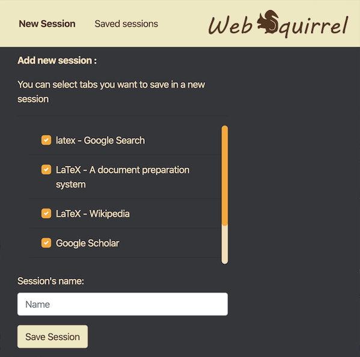
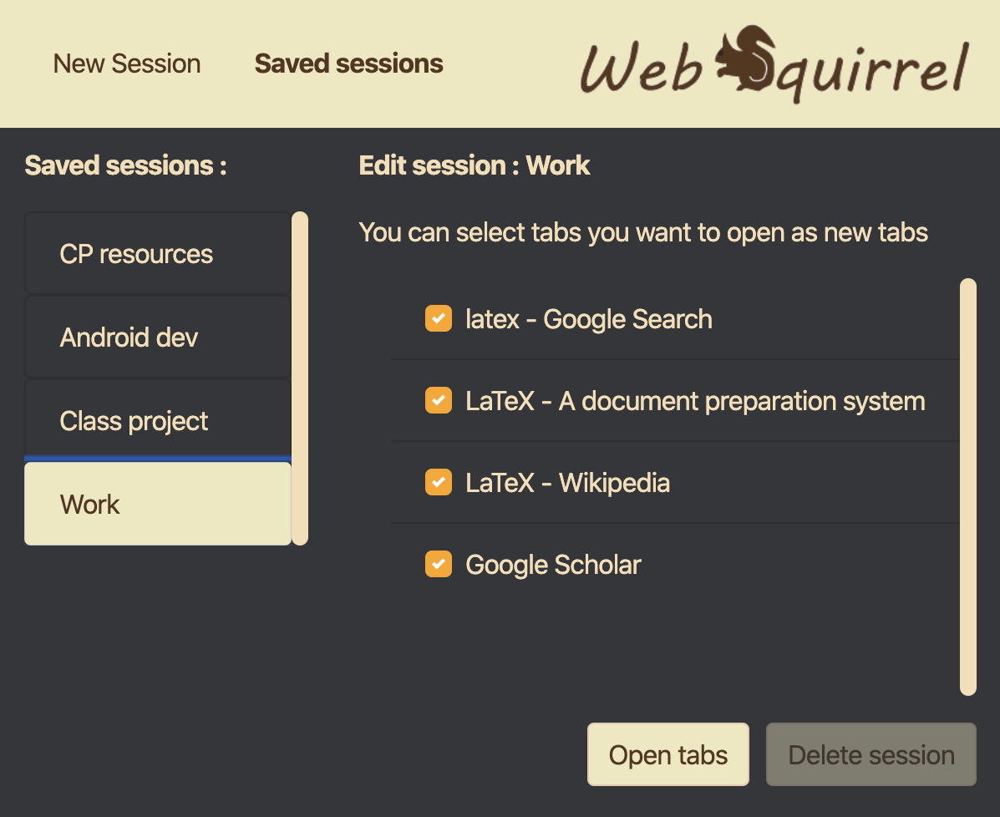

Did you ever dig so deep online that you end up with a dozen of open tabs that you need to see, but you run out of time and wish there could be a simple way to save your links for later ? Well I have. On multiple occasions. Almost every time I open a browser. So instead of using a text editor to save my links, I decided to make an extension that will handle this for me. 

### Web Squirrel :

Web Squirrel is a simple extension that allows you to store your open tabs is sessions. You can then manage all your saved sessions, by opening tabs within a session or deleting it.

**Why the name ?** Well just like a squirrel collects precious nuts, this extension lets you collect your precious online findings. 

### Download link :

To use the extension, you can download it from [chrome web store](https://chrome.google.com/webstore/detail/web-squirrel-session-mana/mnilmdpojbgbkgjpajpeeifgjmccoopf).

The source code can be viewed [here](https://github.com/riadeb/Web-Squirrel).

The design of the extension (logo, colors) have been done as a graphic design project course, and I'd like to thank Mehdi Benharrats and Lucas Maia for that.